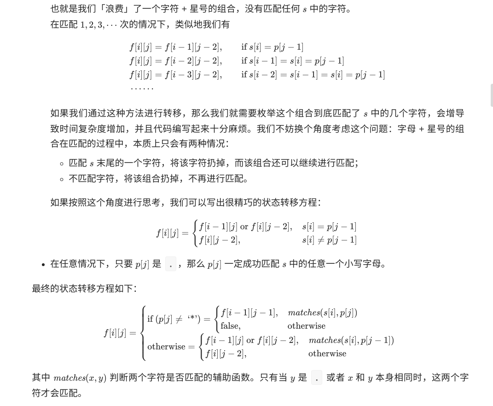

##### 题目描述

给你一个字符串 `s` 和一个字符规律 `p`，请你来实现一个支持 `'.'` 和 `'*'` 的正则表达式匹配。

```
'.' 匹配任意单个字符
'*' 匹配零个或多个前面的那一个元素
```

所谓匹配，是要涵盖 **整个** 字符串 `s`的，而不是部分字符串。

**说明:**

- `s` 可能为空，且只包含从 `a-z` 的小写字母。
- `p` 可能为空，且只包含从 `a-z` 的小写字母，以及字符 `.` 和 `*`。

**示例 1:**

```
输入:
s = "aa"
p = "a"
输出: false
解释: "a" 无法匹配 "aa" 整个字符串。
```

**示例 2:**

```
输入:
s = "aa"
p = "a*"
输出: true
解释: 因为 '*' 代表可以匹配零个或多个前面的那一个元素, 在这里前面的元素就是 'a'。因此，字符串 "aa" 可被视为 'a' 重复了一次。
```

**示例 3:**

```
输入:
s = "ab"
p = ".*"
输出: true
解释: ".*" 表示可匹配零个或多个（'*'）任意字符（'.'）。
```

**示例 4:**

```
输入:
s = "aab"
p = "c*a*b"
输出: true
解释: 因为 '*' 表示零个或多个，这里 'c' 为 0 个, 'a' 被重复一次。因此可以匹配字符串 "aab"。
```

**示例 5:**

```
输入:
s = "mississippi"
p = "mis*is*p*."
输出: false
```


##### 动态规划



```kotlin
class Solution {
    fun isMatch(s: String, p: String): Boolean {
        val m = s.length
        val n = p.length
        val res = Array<Array<Boolean>>(m + 1) {Array<Boolean> (n + 1) { false }}
        res[0][0] = true
        for (i in 0 .. m) {
            for (j in 1 .. n) {
                if (p[j - 1] == '*') {
                    res[i][j] = res[i][j - 2]
                    if (match(s, p, i, j - 2)) {
                        res[i][j] = res[i - 1][j] || res[i][j - 2]
                    }
                } else {
                    res[i][j] = if (match(s, p, i, j - 1)) res[i - 1][j - 1] else false
                }
            }
        }
        return res[m][n]
    }

    fun match(s: String, p: String, i: Int, j: Int): Boolean {
        if (i == 0) {
            return false
        }
        if (p[j] == '.') {
            return true
        }
        return s[i - 1] == p[j]
    }
}
```

